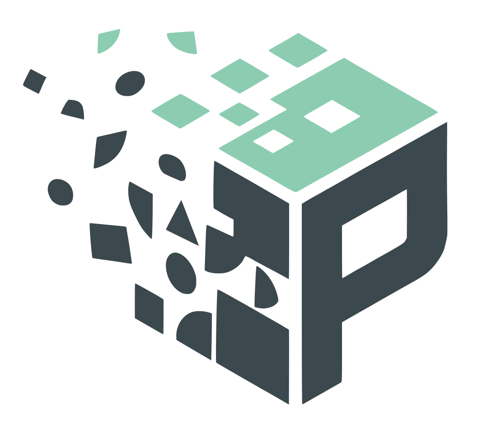

<p align="center">
  <a href="https://preqstation.com">
    
  </a>
</p>

<h1 align="center">PreqStation Core App</h1>

<p align="center">
  <strong>Task control plane, Kanban workflow, API, and MCP server for AI-agent execution.</strong>
</p>

<p align="center">
  <a href="https://preqstation.com">Website</a> ·
  <a href="https://preqstation.com/guide">Guide</a> ·
  <a href="https://github.com/sonim1/preqstation">Core App</a> ·
  <a href="https://github.com/sonim1/preqstation-dispatcher">PREQ CLI</a> ·
  <a href="https://github.com/sonim1/preqstation-skill">Worker Skill</a>
</p>

<p align="center">
  <a href="LICENSE"></a>
  <a href="https://nodejs.org"></a>
</p>

---

## What this repo owns

`preqstation` is the core app and system of record in the PreqStation stack. It owns the Kanban board, task lifecycle, work logging, owner workspace, REST API, and HTTP MCP surfaces that coding agents use to read and update tasks programmatically.

PreqStation is a multi-surface system:

- [`preqstation`](https://github.com/sonim1/preqstation) — core app, task lifecycle, API, MCP, and architecture
- [`preqstation-dispatcher`](https://github.com/sonim1/preqstation-dispatcher) — PREQ CLI for operator-host setup, project mapping, health checks, and direct or integration-based dispatch
- [`preqstation-skill`](https://github.com/sonim1/preqstation-skill) — worker/runtime setup for Claude Code, Codex, and Gemini
- [`preqstation-landingpage`](https://github.com/sonim1/preqstation-landingpage) — public website and guide

If you are new to the system, start with the [public guide](https://preqstation.com/guide), then return here for core app and architecture details.

---

## Features

- **Projects** — create and manage projects with GitHub/Vercel URL tracking
- **Kanban board** — drag-and-drop task management across 6 workflow statuses (`inbox`, `todo`, `hold`, `ready`, `done`, `archived`)
- **Offline workspace workflow** — cached `/`, `/dashboard`, `/board`, visited `/board/:key`, and `/projects` routes with IndexedDB-backed board/projects snapshots, task drafts, plus queued create/edit/move/delete sync when connectivity returns
- **Execution overlay** — task cards can show `Requested` / `Running` independently from workflow position
- **PREQSTATION Task API** — REST API at `/api/tasks` for AI agent integration with Bearer token auth
- **Connections** — review and revoke OAuth/MCP clients from `/connections`
- **Notifications** — review task completion notices and expiring MCP/browser connections from the notification drawer
- **Command Palette** — keyboard-driven navigation via Mantine Spotlight
- **Authenticator-app 2FA** — optional TOTP verification for owner sign-in
- **Today Focus** — pin tasks to surface daily priorities
- **Markdown task notes** — edit checklists, artifacts, and fenced Mermaid diagrams with live rendering
- **Activity tracking** — work logs linked to projects and tasks
- **Audit logs** — immutable record of all mutations
- **Security events** — login allow/deny and authorization failure logging

---

## Tech Stack

| Layer      | Technology                        |
| ---------- | --------------------------------- |
| Framework  | Next.js 16                        |
| UI         | React 19, Mantine 8, Tabler Icons |
| Charts     | Recharts, @mantine/charts         |
| ORM        | Drizzle ORM                       |
| Database   | PostgreSQL                        |
| Validation | Zod                               |
| Editor     | Lexical                           |
| Testing    | Vitest, Playwright                |
| Language   | TypeScript 5                      |

---

## Quick Start

```bash
git clone https://github.com/sonim1/preqstation.git
cd preqstation
cp .env.example .env.local
npm install
npm run db:migrate
npm run dev
```

The app runs at `http://localhost:3000` by default. See [docs/INSTALLATION.md](docs/INSTALLATION.md) for environment variables, owner setup, and development commands.

## Documentation

- [Installation](docs/INSTALLATION.md) — local setup, env vars, first-run onboarding, and development commands
- [Architecture](docs/architecture.md) — current system structure and workflow contract
- [API](docs/API.md) — REST and MCP integration surfaces
- [Offline Board](docs/OFFLINE_BOARD.md) — browser offline cache, IndexedDB state, and replay behavior
- [Project Structure](docs/PROJECT_STRUCTURE.md) — repository layout
- [Security](docs/security.md) — full security design

## Security

PreqStation is designed for a single owner. All routes require authentication and all data is scoped to that owner at the database level in PostgreSQL.

Key policies:

- Session cookies are `httpOnly`, `sameSite=strict`, signed with HMAC
- Login verifies the single owner against the `users` table, with optional authenticator-app 2FA
- Row level security is enabled across the app schema and owner-scoped requests set `app.user_id` before querying
- Authenticated pages, server actions, and APIs use `withOwnerDb(ownerId, ...)` instead of ambient access to the global `db`
- Bootstrap/login/OAuth flows and security-event writes use explicit admin access via `withAdminDb(...)`
- `/mcp` uses OAuth discovery + bearer access tokens instead of raw API keys
- Middleware enforces authentication on every route except public health/login/OAuth discovery routes
- Rate limiting is applied to auth and protected API routes
- Mutating APIs enforce same-origin verification
- Login and authorization failures are recorded in `security_events`

See [`docs/security.md`](docs/security.md) for the full security design.

---

## License

MIT — see [LICENSE](LICENSE).
