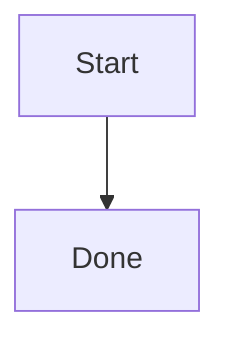

# PREQSTATION Architecture

## Overview

PREQSTATION is a task management platform designed for AI-agent-driven development workflows. It consists of three interconnected systems:

| System                     | Role                                                                                                                             | Repository               |
| -------------------------- | -------------------------------------------------------------------------------------------------------------------------------- | ------------------------ |
| **preqstation**            | Central web service — task CRUD, Kanban UI, REST API, Telegram notifications                                                     | `preqstation`            |
| **preqstation-dispatcher** | OpenClaw-native dispatcher layer — receives Telegram/OpenClaw dispatch requests and launches coding agents in isolated worktrees | `preqstation-dispatcher` |
| **preqstation-skill**      | Agent client — MCP server and shell helpers that coding agents use to call Preq Station APIs (`preqstation`)                     | `preqstation-skill`      |

Important naming note:

- the durable public repo/system name is `preqstation-dispatcher`
- some current package/plugin/config identifiers may still use `preqstation-openclaw` for compatibility
- architecture docs should prefer `preqstation-dispatcher` except when a specific technical identifier is required

## System Diagram

```
┌──────────────────────────────────────────────────────────────┐
│                    preqstation (Web Service)                 │
│                                                              │
│  Next.js 16 · React 19 · Mantine 8 · Drizzle · Neon PG     │
│                                                              │
│  ┌────────────┐  ┌──────────────┐  ┌───────────────────┐    │
│  │ Kanban UI  │  │  REST API    │  │  Telegram Client  │    │
│  │ Dashboard  │  │  /api/tasks  │  │  /api/telegram     │    │
│  │ Settings   │  │  /api/keys   │  │                   │    │
│  └────────────┘  └──────┬───────┘  └────────┬──────────┘    │
│                         │                    │               │
└─────────────────────────┼────────────────────┼───────────────┘
                          │                    │
                  API calls (Bearer token)     │ Sends notifications
                          │                    │
                          │                    ▼
                          │           ┌─────────────────┐
                          │           │    Telegram      │
                          │           └────────┬────────┘
                          │                    │
                          │                    │ User forwards / bot relays
                          │                    ▼
                          │           ┌─────────────────────────────────┐
                          │           │      OpenClaw (Runtime)         │
                          │           │                                 │
                          │           │  Receives message, triggers     │
                          │           │  /preqstation dispatch command   │
                          │           └────────────────┬────────────────┘
                          │                            │
                          │                   Parses intent, creates
                          │                   git worktree, launches
                          │                   coding agent (PTY+bg)
                          │                            │
                          │                            ▼
                          │           ┌─────────────────────────────────┐
                          │           │     Coding Agent                │
                          │           │     (Claude / Codex / Gemini)   │
                          │           │                                 │
                          │           │  Runs in isolated worktree      │
                          │           │  Implements code changes        │
                          ◄───────────│  Uses preqstation-skill MCP     │
                                      │  to report status & results     │
                                      └─────────────────────────────────┘
```

## Data Flow

### 1. Task Creation and Notification

```
User creates task in Kanban UI
  → preqstation stores in PostgreSQL
  → (optional) preqstation sends Telegram notification
     → default/OpenClaw task sends go to the OpenClaw chat
     → Hermes-targeted task sends go to the Hermes chat
```

### 2. Agent Trigger via Telegram Dispatch Targets

```
preqstation  →  dispatch target selected
             →  Telegram message
                        →  OpenClaw chat receives default task sends, /status, and QA/insight sends
                           that target `telegram`
                        →  Hermes chat receives task, QA, and project insight sends that target
                           `hermes-telegram`
                           →  receiving bot/runtime parses: engine, optional model, task ID, project key
                              →  Resolves project path from explicit path, plugin config, shared mapping file, or MEMORY.md
                              →  Creates git worktree (isolated env)
                              →  Launches coding agent (claude/codex/gemini CLI)
```

### 3. Agent Execution and Status Reporting

```
Coding agent checks task status via preq_get_task, then:

  inbox       → preq_plan_task (write plan, → todo). Stop.
  todo        → preq_start_task (runState → running)
              → Implement + test + deploy per strategy
              → preq_complete_task (→ ready, runState cleared)
              → Stop. Do not call preq_review_task in the same run.
  ready       → Run verification (tests, build, lint)
              → preq_review_task (→ done)
              → Stop.

  If `feature_branch + auto_pr + commit_on_review` is enabled, `preq_complete_task`
  cannot move the task to `ready` until the pushed branch name and PR URL are supplied.
  Telegram dispatch before agent pickup can mark the task as runState=queued.
  On any failure → preq_block_task (→ hold)
```

---

## preqstation

### Tech Stack

| Layer      | Technology                                                 |
| ---------- | ---------------------------------------------------------- |
| Framework  | Next.js 16 (App Router)                                    |
| UI         | React 19, Mantine 8, Tabler Icons, Recharts                |
| Editor     | Lexical                                                    |
| ORM        | Drizzle ORM                                                |
| Database   | PostgreSQL                                                 |
| Validation | Zod                                                        |
| Auth       | Session cookies (HMAC-signed), bcryptjs, optional TOTP 2FA |

### Database Schema

| Table                           | Purpose                                                                                                         |
| ------------------------------- | --------------------------------------------------------------------------------------------------------------- |
| `users`                         | Single-owner account, password hash, optional TOTP 2FA state                                                    |
| `tasks`                         | Task items with `taskKey` (e.g. `PROJ-123`), workflow status, priority, engine, branch, sort order, `run_state` |
| `task_labels`                   | Project-owned task label taxonomy (`project_id` required, unique name per project, owner-protected via RLS)     |
| `projects`                      | GitHub/Vercel project tracking with GitHub repo ID, background image, soft-delete                               |
| `project_settings`              | Per-project config (deploy strategy, default branch, auto PR, squash merge, agent instructions)                 |
| `oauth_clients`                 | Registered OAuth clients for MCP installs, including client name and redirect URIs                              |
| `mcp_connections`               | Owner-visible MCP connection metadata (display name, engine, last used, expiry, revoked state)                  |
| `api_tokens`                    | Legacy bearer tokens for direct REST automation (SHA-256 hashed, prefix `preq_`, optional expiration)           |
| `work_logs`                     | Durable audit trail of agent execution results (linked to task and project)                                     |
| `task_notifications`            | Task completion notifications, read state, and notification drawer history                                      |
| `connection_notification_reads` | Read receipts for generated MCP/browser connection-expiration notifications keyed by owner and notification key |
| `events_outbox`                 | Event sourcing (task/project/worklog CRUD events)                                                               |
| `audit_logs`                    | Immutable mutation log (all API actions)                                                                        |
| `security_events`               | Login attempts, auth failures, IP/user-agent tracking                                                           |
| `user_settings`                 | Key-value config (Telegram bot token, split OpenClaw/Hermes chat IDs and enabled flags, timezone, etc.)         |

### Database Access Boundary

- All authenticated reads and writes run through `withOwnerDb(ownerId, ...)`.
- `withOwnerDb` starts a transaction, sets the PostgreSQL setting `app.user_id`, and then executes Drizzle queries under row level security.
- Helper modules that touch owner-scoped tables accept a `client`/transaction parameter so routes, pages, and server actions do not fall back to the ambient global `db`.
- `withAdminDb(...)` is used only for trusted bypass flows such as login, OAuth client/code/token issuance, MCP connection validation, API token hashing lookups, and unauthenticated security-event logging.

### REST API

**Authentication:** `Authorization: Bearer <preq_xxxxx>` for external APIs, session cookie for internal APIs.

#### External APIs (Bearer token)

| Method   | Endpoint                     | Purpose                                                                |
| -------- | ---------------------------- | ---------------------------------------------------------------------- |
| `GET`    | `/api/tasks`                 | List tasks (filter: `?status=`, `?engine=`, `?label=`, `?projectKey=`) |
| `POST`   | `/api/tasks`                 | Create task                                                            |
| `GET`    | `/api/tasks/:id`             | Get task by taskKey or UUID                                            |
| `PATCH`  | `/api/tasks/:id`             | Update task (fields, status, result)                                   |
| `DELETE` | `/api/tasks/:id`             | Delete task                                                            |
| `PATCH`  | `/api/tasks/:id/status`      | Update status only                                                     |
| `GET`    | `/api/projects`              | List projects                                                          |
| `POST`   | `/api/projects`              | Create project                                                         |
| `GET`    | `/api/projects/:id/settings` | Get project settings for deploy strategy and agent guidance            |
| `PATCH`  | `/api/projects/:id`          | Update project                                                         |
| `DELETE` | `/api/projects/:id`          | Delete project                                                         |
| `POST`   | `/api/api-keys`              | Legacy compatibility: issue new API token                              |
| `GET`    | `/api/api-keys`              | Legacy compatibility: list tokens                                      |
| `DELETE` | `/api/api-keys/:id`          | Legacy compatibility: revoke token                                     |
| `POST`   | `/api/work-logs`             | Create work log entry                                                  |
| `GET`    | `/api/health`                | Health check (no auth)                                                 |

Canonical workflow statuses are `inbox`, `todo`, `hold`, `ready`, `done`, and `archived`. External task payloads can also include `run_state` (`queued` / `running` / `null`) plus `run_state_updated_at`. Task APIs reject legacy status aliases, and internal todo APIs accept `labelIds` only.

#### Artifacts

Tasks and QA runs persist structured artifacts in a JSON `artifacts` field. Full task responses include `artifacts`; compact task lists omit it. `POST /api/tasks`, `PATCH /api/tasks/:id`, and `PATCH /api/qa-runs/:id` accept up to 50 artifacts, and MCP tools forward artifacts through `preq_update_task_note`, `preq_complete_task`, and `preq_update_qa_run`.

Accepted artifact objects are normalized to:

| Field       | Type   | Notes                                                                                             |
| ----------- | ------ | ------------------------------------------------------------------------------------------------- |
| `type`      | string | One of `image`, `video`, `document`, or `link`; URL-only entries default to `link`                |
| `title`     | string | Trimmed display title; defaults to `Artifact`, `Local artifact`, or `Artifact publishing skipped` |
| `url`       | string | Optional `http` or `https` URL                                                                    |
| `localPath` | string | Optional local artifact path; `local_path` is also accepted                                       |
| `reason`    | string | Optional explanation when publishing is skipped or unavailable                                    |
| `provider`  | string | Optional storage or publishing provider                                                           |
| `access`    | string | Optional access scope or visibility                                                               |
| `expires`   | string | Optional expiry text; `expiration` is also accepted                                               |
| `metadata`  | object | Optional object metadata; arrays and scalar values are ignored                                    |

Each text field is trimmed and capped at 2,000 characters. Invalid artifact entries are ignored, duplicate entries are collapsed by `type`, `url`, `localPath`, and title, and accepted arrays are capped at 50 artifacts. A valid artifact needs a supported type and at least one of `url`, `localPath`, or `reason`.

Legacy markdown artifact blocks are still accepted in task notes and QA reports:

```markdown
Artifacts:

- [image] Screenshot title | provider=fastio | access=private | url=https://example.com/screenshot.png
```

When such a block is parsed, supported entries (`image`, `video`, or `document` with a safe URL) move into the structured `artifacts` field and are removed from the stored markdown body. The `0022_task_artifacts` migration adds non-null JSONB `artifacts` columns to `tasks` and `qa_runs` with `[]` defaults, so existing rows migrate without backfill work and begin returning an empty artifacts array until new artifacts are stored.

#### Markdown rendering

Task notes, the live markdown editor, and QA report markdown render fenced Mermaid diagrams when
the block uses a top-level `mermaid` code fence:

````markdown

````

Mermaid diagrams render in the browser with Mermaid strict security mode. Indented Mermaid fences
and unterminated fences are treated as normal markdown text.

Authenticated REST handlers await the scoped DB call inside their route `try` blocks so PostgreSQL constraint/RLS errors are translated into HTTP responses instead of escaping the handler promise.

#### Internal APIs (Session cookie)

| Method   | Endpoint                            | Purpose                                                               |
| -------- | ----------------------------------- | --------------------------------------------------------------------- |
| `GET`    | `/api/todos`                        | List todos (internal dashboard)                                       |
| `POST`   | `/api/todos`                        | Create todo                                                           |
| `PATCH`  | `/api/todos/:id`                    | Update todo                                                           |
| `DELETE` | `/api/todos/:id`                    | Delete todo                                                           |
| `POST`   | `/api/todos/rebalance`              | Rebalance sort order                                                  |
| `POST`   | `/api/todos/archive-done`           | Archive completed todos                                               |
| `GET`    | `/api/projects/:id/labels`          | List labels for one project                                           |
| `POST`   | `/api/projects/:id/labels`          | Create a label for one project                                        |
| `PATCH`  | `/api/projects/:id/labels/:labelId` | Update one project label                                              |
| `DELETE` | `/api/projects/:id/labels/:labelId` | Delete one project label                                              |
| `POST`   | `/api/events/cleanup`               | Clean up old outbox entries                                           |
| `GET`    | `/api/settings`                     | Get user settings                                                     |
| `PATCH`  | `/api/settings`                     | Update user settings                                                  |
| `GET`    | `/api/notifications`                | List unread or read notification drawer items                         |
| `PATCH`  | `/api/notifications`                | Mark selected or all notification drawer items as read                |
| `GET`    | `/api/tasks/:id/comments`           | List comments for one task                                            |
| `POST`   | `/api/tasks/:id/comments`           | Add a task comment and optionally dispatch an agent follow-up         |
| `POST`   | `/api/projects/:id/qa-runs/trigger` | Queue selected ready task keys for QA via OpenClaw or Hermes Telegram |
| `POST`   | `/api/telegram/send`                | Send task Telegram message to OpenClaw or Hermes                      |
| `POST`   | `/api/telegram/send/insight`        | Send project insight to the OpenClaw or Hermes Telegram channel       |
| `POST`   | `/api/telegram/test`                | Test Telegram connection                                              |
| `POST`   | `/api/send-to-openclaw`             | Legacy OpenClaw message relay                                         |
| `GET`    | `/api/work-logs/:id`                | Get work log entry                                                    |
| `DELETE` | `/api/work-logs/:id`                | Delete work log entry                                                 |

Legacy `/api/task-labels` and `/api/task-labels/:id` handlers are compatibility tombstones only: they return `410 Gone` and point callers to the canonical `/api/projects/:id/labels*` routes.

The notification drawer uses `/api/notifications` to merge persisted task-completion notifications
with generated connection-expiration notifications for MCP connections and browser sessions that
expire within three days. `PATCH /api/notifications` updates both notification sources; generated
connection-expiration read state is persisted in `connection_notification_reads`.

### Offline Workspace Path

The workspace keeps a browser-local offline path layered on top of the normal internal
`/api/todos` workflow.

- `app/components/pwa-registration.tsx` registers `/sw.js` for browser sessions.
- `public/sw.js` caches same-origin `/`, `/dashboard`, `/projects`, `/board`, and `/board/:key`
  navigations plus static assets. Navigation fetches use a 15-second timeout before falling back to
  cached HTML. It does not cache `/api/*` responses, so queued writes still reconcile against the
  live backend.
- `public/offline.html` is precached and returned when a workspace navigation misses both the
  network and the corresponding cached HTML document, which keeps the browser from falling back to
  its localized network error page. The uncached root `/` start route uses the same dashboard
  recovery copy as `/dashboard`.
- IndexedDB database `preqstation-offline` contains `snapshots` for recent board/task/projects
  payloads, `drafts` for task-edit title/note drafts, and `mutations` for queued offline
  create/patch/delete records.
- `OfflineBoardHydrator` writes the latest board snapshot per project key and rehydrates the Kanban
  store from that snapshot when the browser is offline.
- `ProjectsOfflineHydrator` writes the latest projects-index snapshot while online and renders
  cached project cards from IndexedDB when `/projects` is loaded offline.
- `OfflineWorkspaceRouteWarmer` issues a no-store fetch for the current `/dashboard`, `/projects`,
  `/board`, or `/board/:key` document while the browser is online and writes the HTML response into
  `preq-board-v3`, so workspace routes the user actually visits are proactively available offline.
- `BoardOfflineSyncProvider` owns optimistic offline board mutations. Offline creates get temporary
  `OFFLINE-*` task keys, edits and moves merge into per-task queued records, deletes are queued as
  delete records, and replay runs again once the connectivity check against `/api/ping` succeeds.
- Offline mutation replay preserves queue order. Create replay posts to `/api/todos`, patch replay
  uses `PATCH /api/todos/:taskKey`, delete replay uses `DELETE /api/todos/:taskKey`, and any queued
  patch for an offline-created task is rekeyed to the server-issued task key after the create
  succeeds. If an offline-created task is deleted before it ever syncs, its queued create/patch
  records are removed instead of replaying a server delete. Note-fingerprint conflicts are treated
  as a handled `409`: the conflicting patch is removed from the queue, the latest `boardTask` and
  `focusedTask` payloads from the server are pushed back into the board UI, and the local draft is
  left intact so the user can decide whether to restore it. Other permanent
  validation/not-found/conflict failures (`400`, `404`, `410`, `422`, plus `409` responses without
  refreshed task payloads) are dropped so later queued mutations can continue, while transient
  failures still halt replay and leave the remaining queue intact for the next retry.
- `useTaskOfflineDraft` compares stored base title and note fingerprints with the latest server
  fingerprints. Non-conflicting drafts are auto-saved online with the task's current metadata
  preserved; title or note conflicts stay restorable so the user can reconcile the local draft
  against the latest server task.

### Task Lifecycle

```
inbox  →  todo  →  ready  →  done
            │        ▲
            │        │
            └─ hold ─┘

execution overlay on top of workflow:
todo + queued   → Telegram dispatched, agent not yet started
todo + running  → agent actively executing
```

### Deployment Strategy Contract

Each project can configure a deployment strategy:

| Setting                   | Values                            | Default         |
| ------------------------- | --------------------------------- | --------------- |
| `deploy_strategy`         | `direct_commit`, `feature_branch` | `direct_commit` |
| `deploy_default_branch`   | branch name                       | `main`          |
| `deploy_auto_pr`          | boolean (feature_branch only)     | `false`         |
| `deploy_commit_on_review` | boolean                           | `true`          |
| `deploy_squash_merge`     | boolean (direct_commit only)      | `true`          |

Behavior:

- **`direct_commit`** — Commit and push to `default_branch`. No PR. When `squash_merge=true`, squash all worktree commits into a single commit when merging to the default branch.
- **`feature_branch`** — Commit and push to task branch. Create PR only when `auto_pr=true` (requires GitHub access on the coding agent via `gh auth` or GitHub MCP).

Missing, invalid, and legacy `deploy_strategy=none` values are normalized to `direct_commit` at runtime, and existing stored `none` rows are backfilled by migration `0020_remove_none_deploy_strategy`.

When `commit_on_review=true`, agents must finish the deploy handoff before transitioning to `ready`. For `feature_branch + auto_pr + commit_on_review`, `preq_complete_task` rejects the transition until both the pushed `branchName` and `prUrl` are provided. The setting name is retained for backward compatibility even though the workflow label is now `ready`.

Projects can also store an `agent_instructions` setting. When present, task payloads returned by `preq_get_task` include that value as `agent_instructions` so coding agents can follow project-scoped response-language guidance.

### Telegram Integration

- Bot token encrypted with AES-GCM (Web Crypto API + HKDF from `AUTH_SECRET`)
- Stored as `v1.{base64urlIV}.{base64urlCiphertext}` in `user_settings`
- Telegram settings are split between OpenClaw and Hermes channels:
  `openclaw_telegram_chat_id` / `openclaw_telegram_enabled` and
  `hermes_telegram_chat_id` / `hermes_telegram_enabled`
- Legacy single-channel settings (`telegram_chat_id` / `telegram_enabled`) remain fallback values
  for older installs until the split settings are saved
- `/api/telegram/send` defaults to the OpenClaw channel and can target the Hermes channel when
  `dispatchTarget=hermes-telegram`
- OpenClaw-targeted task, QA, and insight sends use the `!/preqstation dispatch ...`
  command format
- Hermes-targeted task, QA, and insight sends use `/preqstation_dispatch`, with the optional
  configured Hermes bot mention attached as `/preqstation_dispatch@<botid>`
- `/api/telegram/send/insight` defaults to the OpenClaw channel and can target Hermes when
  `dispatchTarget=hermes-telegram`
- `POST /api/projects/:id/qa-runs/trigger` requires a non-empty `taskKeys` array. It accepts
  `telegram` and `hermes-telegram`, an optional `model`, validates every selected key is a ready
  task in the project, creates the queued QA run record for only those selected ready tasks in
  ready board order, and sends the selected Telegram dispatch message.
- `POST /api/tasks/:id/comments` accepts optional `model` metadata when a comment queues an agent
  follow-up. `dispatch=false` keeps the comment local and skips Telegram dispatch.
- Project insight dispatch follows the same target vocabulary and always sends through
  `/api/telegram/send/insight`
- There is no in-app `Channels` / `claude-code-channel` fallback for QA or project insight dispatch
- OpenClaw `/status` checks remain OpenClaw-only
- Messages are audit logged and used to notify users of task events and trigger downstream runtime workflows

### Agent Model Catalog

- `agent_model_catalog` is stored in `user_settings` and can be saved through **Settings -> Agent
  Models** or `PATCH /api/settings`.
- A blank value resolves to the built-in catalog. Saved JSON is normalized into this shape:
  `{ "claude-code": AgentModelOption[], "codex": AgentModelOption[], "gemini-cli": AgentModelOption[] }`.
- Each `AgentModelOption` is `{ "label": string, "value": string }`. String entries are accepted
  and normalized into label/value pairs; unsupported engine keys, duplicates, and invalid model IDs
  are dropped.
- Dispatch model selection is message metadata. Blank, `default`, `__default__`, overlong, or
  invalid model IDs normalize to no override.
- Valid model overrides are appended as `model` metadata to OpenClaw
  `!/preqstation dispatch ...` commands and Hermes `/preqstation_dispatch` commands,
  including the optional `@<botid>` command mention suffix, for task dispatch, dispatched comments, QA
  dispatch, and project insight dispatch.
- Model overrides do not update `tasks.engine`, workflow status, or the persisted QA run record.

### Event System

Events written to `events_outbox` on task mutations:

- `TASK_CREATED`, `TASK_STATUS_CHANGED`, `TASK_UPDATED`, `TASK_DELETED`
- `WORKLOG_CREATED`, `PROJECT_CREATED`, `PROJECT_DELETED`

Work logs automatically created when agents submit `result` payloads, storing execution summaries, test results, PR URLs, and timestamps.

---

## preqstation-dispatcher

### Purpose

Bridges Telegram/OpenClaw dispatch requests to coding agent execution. When a user sends a task request through Telegram and it reaches OpenClaw, the dispatcher parses the intent, resolves the target project path, and launches the appropriate coding agent in an isolated git worktree.

Important naming note:

- the durable public repo name is `preqstation-dispatcher`
- some package, plugin, or config identifiers may still use `preqstation-openclaw` for compatibility
- treat those legacy identifiers as technical implementation details, not the preferred public system name

### Execution Flow

```
1. Parse user message
   → engine (`claude-code`/`codex`/`gemini-cli`, default: `claude-code`)
   → task ID (e.g. PROJ-284)
   → project key
   → branch name (optional)
   → objective

2. Resolve project path
   → explicit absolute path in the message, if present
   → saved plugin mapping
   → shared `~/.preqstation-dispatch/projects.json`
   → fallback `MEMORY.md`

3. Create isolated worktree
   → git -C <project_cwd> worktree add -b <branch> <worktree_path> HEAD
   → Worktree root: `${OPENCLAW_WORKTREE_ROOT:-/tmp/openclaw-worktrees}`

4. Render prompt bootstrap
   → write `.preqstation-prompt.txt`
   → include task context, branch, objective, and execution constraints

5. Launch coding agent as a detached process
   → Claude:  claude --dangerously-skip-permissions '<prompt>'
   → Codex:   codex exec --dangerously-bypass-approvals-and-sandbox '<prompt>'
   → Gemini:  GEMINI_SANDBOX=false gemini -p '<prompt>'

6. Monitor via detached runtime artifacts
   → `.preqstation-dispatch/<engine>.pid`
   → `.preqstation-dispatch/<engine>.log`
```

### Key Design Decisions

- **Worktree-first execution** — Agents never run in the primary checkout. Every task gets its own worktree for isolation.
- **Detached launch model** — The dispatcher no longer treats PTY/background session monitoring as the primary public contract.
- **Layered project-path resolution** — Project paths resolve from explicit paths, plugin config, the shared mapping file, or fallback `MEMORY.md`.
- **Branch naming** — Must include project key. Format: `preqstation/<project_key>/<branch_slug>`.
- **Worktree cleanup** — The coding agent cleans up its own worktree (`git worktree remove` + `prune`) as the final step before exiting, regardless of success or failure.
- **PREQSTATION workflow in prompt** — The rendered prompt includes explicit instructions for the agent to use `preq_*` MCP tools (fetch task, check deploy strategy, update status, submit results). Each run follows exactly one lifecycle branch; execution starts from `todo`, uses `runState` to show `queued` / `running`, stops after `preq_complete_task` moves the task to `ready`, and only `ready` tasks should proceed to `preq_review_task`. For `feature_branch + auto_pr + commit_on_review`, the completion call must include the pushed `branchName` and `prUrl` first.

### Progress Modes

| Mode               | Behavior                                                            |
| ------------------ | ------------------------------------------------------------------- |
| `sparse` (default) | Updates only on state changes (start, milestone, error, completion) |
| `live`             | State-change updates + periodic heartbeats every 1-2 minutes        |

---

## preqstation-skill

### Purpose

MCP server and shell helpers that coding agents (Claude, Codex, Gemini) use to interact with the Preq Station REST API during task execution.

### Installation

```bash
# Claude Code
claude mcp add -s user \
  --env='PREQSTATION_API_URL=https://<domain>' \
  --env='PREQSTATION_TOKEN=preq_xxxxx' \
  preqstation -- \
  node <path>/scripts/preqstation-mcp-server.mjs

# Codex
codex mcp add preqstation \
  --env='PREQSTATION_API_URL=https://<domain>' \
  --env='PREQSTATION_TOKEN=preq_xxxxx' \
  -- node <path>/scripts/preqstation-mcp-server.mjs
```

### MCP Tools

| Tool                         | Type     | Purpose                                                                                                                               |
| ---------------------------- | -------- | ------------------------------------------------------------------------------------------------------------------------------------- |
| `preq_list_projects`         | Read     | List projects for setup flows such as local repository mapping                                                                        |
| `preq_list_tasks`            | Read     | List tasks by status, label, engine, projectKey                                                                                       |
| `preq_list_project_activity` | Read     | Page through project activity events across tasks, task comments, and work logs by ISO date range                                     |
| `preq_get_task`              | Read     | Fetch task details by ticket number or UUID                                                                                           |
| `preq_get_project_settings`  | Read     | Fetch project settings such as deploy strategy and agent instructions                                                                 |
| `preq_create_task`           | Mutation | Create new task (→ inbox)                                                                                                             |
| `preq_plan_task`             | Mutation | Upload plan markdown, move inbox → todo                                                                                               |
| `preq_start_task`            | Mutation | Mark a todo task as actively running (`runState=running`)                                                                             |
| `preq_update_task_status`    | Mutation | Status-only update                                                                                                                    |
| `preq_complete_task`         | Mutation | Upload result, move → ready, clear execution state; requires `branchName` + `prUrl` for `feature_branch + auto_pr + commit_on_review` |
| `preq_review_task`           | Mutation | Verify a ready task and move → done (or → hold)                                                                                       |
| `preq_block_task`            | Mutation | Move task → hold with a blocking reason                                                                                               |
| `preq_delete_task`           | Mutation | Permanently delete task                                                                                                               |

### Engine Resolution Priority

All mutation tools track which agent performed the action:

1. Explicit `engine` parameter in tool call
2. Existing task `engine` field (from database)
3. MCP client auto-detection (inferred from `clientInfo.name`)
4. `PREQSTATION_ENGINE` environment variable
5. Fallback: `codex`

### Shell Helper Mode

When MCP is unavailable, source `scripts/preqstation-api.sh` for curl-based REST wrappers with identical functionality. Requires `jq`.

---

## Environment Variables

### preqstation

| Variable          | Required | Purpose                             |
| ----------------- | -------- | ----------------------------------- |
| `AUTH_SECRET`     | Yes      | HMAC session secret (min 16 chars)  |
| `DATABASE_URL`    | Yes      | PostgreSQL connection string        |
| `ALLOWED_ORIGINS` | No       | CORS verification (comma-separated) |
| `CRON_SECRET`     | No       | Vercel cron job auth                |

Owner credentials are stored in the `users` table as `email` + `password_hash`.
Optional authenticator-app 2FA stores `two_factor_enabled` plus an AES-GCM encrypted
`two_factor_secret`.
For existing deployments, update the existing owner row in place so related data keeps the same `owner_id`.

### preqstation-skill (agent-side)

| Variable              | Required | Purpose                                    |
| --------------------- | -------- | ------------------------------------------ |
| `PREQSTATION_API_URL` | No       | Shell-helper or legacy stdio REST base URL |
| `PREQSTATION_TOKEN`   | No       | Shell-helper or legacy stdio bearer token  |
| `PREQSTATION_ENGINE`  | No       | Default engine when auto-detection fails   |

Recommended MCP installs now target `https://<preqstation-domain>/mcp` directly and authenticate with OAuth instead of local REST tokens.

### preqstation-dispatcher

| Variable                 | Required | Purpose                                                 |
| ------------------------ | -------- | ------------------------------------------------------- |
| `OPENCLAW_WORKTREE_ROOT` | No       | Worktree directory (default: `/tmp/openclaw-worktrees`) |

---

## Security

### Authentication

- **Web UI** — Session cookies (httpOnly, sameSite=strict, HMAC-signed), with optional TOTP 2FA
- **REST API** — Bearer token (`preq_` prefix, SHA-256 hashed in DB) for legacy/direct automation
- **Telegram bot token** — AES-GCM encrypted at rest

### Authorization

- Row Level Security (RLS) on PostgreSQL — all data scoped to owner
- API tokens scoped to issuing owner with optional expiration
- MCP connections enforce revocation and expiry from persisted connection metadata
- Same-origin verification on state-changing requests

### Audit Trail

- `audit_logs` — Immutable record of all API mutations
- `security_events` — Login attempts, auth failures
- `work_logs` — Agent execution results with engine attribution
- `events_outbox` — Event sourcing for downstream processing

### Agent Isolation

- preqstation-dispatcher enforces worktree-first execution
- Agents never run in primary checkout directories
- Agents never run in `~/clawd/` or `~/.openclaw/`
- `dangerously-*` flags allowed only after safety gate validation in resolved worktrees
